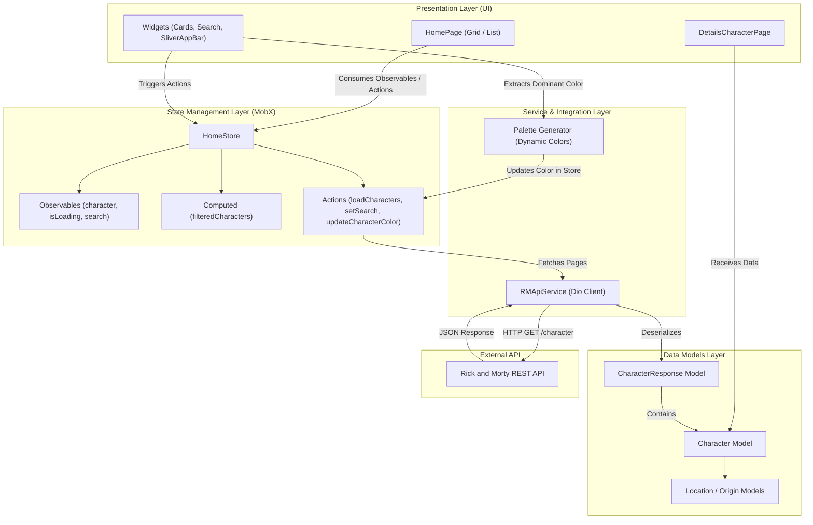

# Rick and Morty App

[](https://flutter.dev/)
[](https://dart.dev/)
[](https://pub.dev/packages/mobx)
[](https://pub.dev/packages/dio)
[](https://rickandmortyapi.com/)

> 🇧🇷 [**Português**](README.md) | 🇺🇸 **English Version**

Mobile application built with Flutter to explore characters from the Rick and Morty multiverse, fetching real-time data from the official REST API with infinite scrolling, dynamic color extraction via Palette Generator, and reactive state management powered by MobX.

## 📌 Quick Navigation

- [📝 About the Project](#-about-the-project)
- [🖼️ Preview](#️-preview)
- [⚡ API Endpoints](#-api-endpoints)
- [✨ Features](#-features)
- [🛠️ Technologies and Tools](#️-technologies-and-tools)
- [🏛️ Solution Architecture](#️-solution-architecture)
- [📁 Repository Structure](#-repository-structure)
- [💡 Technical Decisions](#-technical-decisions)
- [🚀 How to Run the Project](#-how-to-run-the-project)

## 📝 About the Project

The **Rick and Morty App** is a mobile application engineered to provide an engaging and interactive experience for fans of the animated show. The app integrates with the public [Rick and Morty API](https://rickandmortyapi.com/), allowing users to browse through hundreds of characters, perform real-time searches by name or identifier, seamlessly switch between list and grid view modes, and inspect detailed character profiles with dynamic color extraction and contrast adjustments.

## 🖼️ Preview

<div align="center">
  
</div>

## ⚡ API Endpoints

The application consumes the official public Rick and Morty REST API (`https://rickandmortyapi.com/api`):

| Method | Endpoint | Parameters | Description |
| :--- | :--- | :--- | :--- |
| `GET` | `/character` | `page` (query, e.g.: `?page=1`) | Lists characters in a paginated format (20 items per page) |
| `GET` | `/character/{id}` | `id` (path) | Retrieves detailed information about a specific character |

## ✨ Features

- 🔍 **Real-Time Search & Filtering:** Instant lookup by name or ID across loaded characters.
- 📱 **Flexible Display Modes (Grid / List):** Smooth switching between detailed list view and compact card grid.
- 🎨 **Dynamic Color Extraction:** Character images are processed using `palette_generator` to style card backgrounds and dynamically calculate high-contrast text colors.
- ♾️ **Infinite Scrolling:** Automatic pagination when reaching the end of the scroll view to fetch additional pages seamlessly.
- 🖼️ **Smart Image Caching:** Powered by `cached_network_image`, providing fast loading with visual placeholders and offline cache.
- ⚡ **Granular Reactivity:** State synchronized reactively via **MobX** and `build_runner`.
- 📄 **Detailed Profile Screen:** Complete breakdown of status (Alive, Dead, Unknown), species, gender, origin planet, current location, and episode appearances.

## 🛠️ Technologies and Tools

| Layer / Purpose | Technology | Description |
| :--- | :--- | :--- |
| **Mobile Framework** | **Flutter (SDK ^3.10.7)** | Cross-platform framework for building native UI |
| **Primary Language** | **Dart** | Strongly typed, async-friendly language optimized for client development |
| **State Management** | **MobX & flutter_mobx** | Transparent reactive state management using Observables, Actions, and Computeds |
| **Code Generation** | **mobx_codegen & build_runner** | Automated boilerplate generation for reactive state classes |
| **HTTP Client** | **Dio 5.9.2** | Robust HTTP client featuring interceptors, base options, and error handling |
| **Color Manipulation** | **palette_generator_master** | Extracts dominant and contrasting color palettes from character images |
| **Media Caching** | **cached_network_image** | Handles asynchronous image downloads, disk/memory caching, and placeholders |
| **External API** | **The Rick and Morty API** | Public REST API providing character, location, and episode metadata |
| **Linter & Best Practices** | **flutter_lints** | Official Flutter lint rules for standard code quality |

## 🏛️ Solution Architecture

The application adopts a clean component-based architecture integrated with reactive MobX state management:



## 📁 Repository Structure

```text
5-app-rick-and-morty/
├── assets/
│   └── images/
│       ├── rick-and-morty.gif    # Animated project demonstration
│       └── rick.png              # Helper images and illustrations
├── lib/
│   ├── models/                   # Data transfer models & JSON serialization
│   │   ├── character.model.dart
│   │   ├── character_response.model.dart
│   │   ├── location_type.model.dart
│   │   ├── origin_type.model.dart
│   │   └── rm_info.model.dart
│   ├── pages/                    # UI screens
│   │   ├── detailsCharacter/     # Character details view
│   │   │   └── details_character.page.dart
│   │   └── home/                 # Main screen with search and listing
│   │       ├── store/            # MobX state store
│   │       │   ├── home.store.dart
│   │       │   └── home.store.g.dart
│   │       ├── widgets/          # Reusable visual components
│   │       │   ├── grid_view_cards.widget.dart
│   │       │   └── list_view_cards.widget.dart
│   │       └── home.page.dart
│   ├── services/                 # Remote API integration layer
│   │   └── rm_api.service.dart   # Dio client and REST calls
│   ├── colors.dart               # Color palette and contrast helpers
│   └── main.dart                 # Application entry point
├── pubspec.yaml                  # Flutter dependencies and configuration
└── README.md                     # Project documentation
```

## 💡 Technical Decisions

- **Granular Reactivity with MobX:** Stores leverage `@observable`, `@action`, and `@computed` so only widgets observing mutated data re-render, ensuring smooth performance during list scrolling.
- **Dynamic Palette Color Extraction:** Integrating `palette_generator` with the custom `getContrastingTextColor` utility dynamically styles each card based on the character's portrait while preserving typography readability.
- **Transparent Infinite Scroll:** A dedicated listener on `ScrollController` detects when the user approaches the viewport boundary and fetches the next batch of characters asynchronously.
- **Network Image Caching:** Utilizing `CachedNetworkImage` minimizes data bandwidth and eliminates frame drops during rapid scrolling.
- **Clear Separation of Concerns:** Modular division across UI, Store, Service, and Model layers ensures maintainability and readiness for unit/widget testing.

## 🚀 How to Run the Project

### Prerequisites
- [Flutter SDK](https://docs.flutter.dev/get-started/install) installed (version 3.10.7 or higher)
- [Dart SDK](https://dart.dev/get-dart)
- Configured Android/iOS emulator or a physical device connected with USB debugging

### Step-by-step

1. **Clone the repository:**
   ```bash
   git clone https://github.com/ludson96/5-app-rick-and-morty.git
   cd 5-app-rick-and-morty
   ```

2. **Install Flutter dependencies:**
   ```bash
   flutter pub get
   ```

3. **Generate MobX code (if needed):**
   ```bash
   flutter pub run build_runner build --delete-conflicting-outputs
   ```

4. **Run the application:**
   ```bash
   flutter run
   ```

<div align="center">
  Developed by <strong>Ludson Pereira dos Santos</strong> 🚀<br />
  <a href="https://www.linkedin.com/in/ludson96/">LinkedIn</a> • <a href="https://github.com/ludson96">GitHub</a> • <a href="mailto:ludson_ps27@hotmail.com">E-mail</a>
</div>
