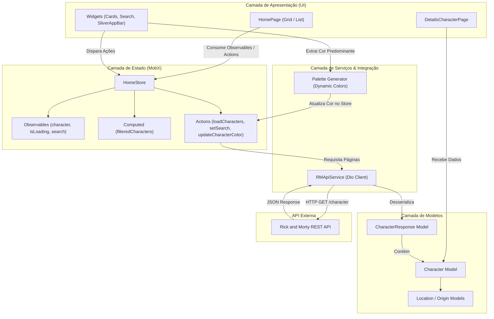

# Rick and Morty App

[](https://flutter.dev/)
[](https://dart.dev/)
[](https://pub.dev/packages/mobx)
[](https://pub.dev/packages/dio)
[](https://rickandmortyapi.com/)

> 🇧🇷 **Português** | 🇺🇸 [**English Version**](README.en.md)

Aplicativo mobile desenvolvido em Flutter para explorar os personagens do multiverso de Rick and Morty, consumindo dados em tempo real da API REST oficial com rolagem infinita, extração dinâmica de cores com Palette Generator e gerenciamento de estado reativo com MobX.

## 📌 Navegação Rápida

- [📝 Sobre o Projeto](#-sobre-o-projeto)
- [🖼️ Preview](#️-preview)
- [⚡ API Endpoints](#-api-endpoints)
- [✨ Funcionalidades](#-funcionalidades)
- [🛠️ Tecnologias e Ferramentas Utilizadas](#️-tecnologias-e-ferramentas-utilizadas)
- [🏛️ Arquitetura da Solução](#️-arquitetura-da-solução)
- [📁 Estrutura do Repositório](#-estrutura-do-repositório)
- [💡 Decisões Técnicas](#-decisões-técnicas)
- [🚀 Como Executar o Projeto](#-como-executar-o-projeto)

## 📝 Sobre o Projeto

O **Rick and Morty App** é uma aplicação mobile construída para proporcionar uma experiência imersiva e interativa aos fãs da série. O aplicativo consome os dados da [Rick and Morty API](https://rickandmortyapi.com/), permitindo navegar por centenas de personagens, pesquisar de maneira instantânea por nome ou identificador, alternar entre modos visuais de lista e grade, e visualizar detalhes aprofundados de cada entidade interdimensional com cálculo dinâmico de contraste e cores temáticas.

## 🖼️ Preview


## ⚡ API Endpoints

O aplicativo consome a API pública oficial do Rick and Morty (`https://rickandmortyapi.com/api`):

| Método | Endpoint | Parâmetros | Descrição |
| :--- | :--- | :--- | :--- |
| `GET` | `/character` | `page` (query, ex: `?page=1`) | Lista personagens de forma paginada (20 por página) |
| `GET` | `/character/{id}` | `id` (path) | Retorna os detalhes de um personagem específico |

## ✨ Funcionalidades

- 🔍 **Busca e Filtro em Tempo Real:** Pesquisa instantânea por nome ou ID diretamente na lista de personagens carregados.
- 📱 **Alternância de Visualização (Grid / List):** Troca dinâmica e fluida entre exibição em lista detalhada ou grade compacta em cards.
- 🎨 **Extração de Cores Dinâmicas:** Análise das imagens dos personagens via `palette_generator` para definir dinamicamente a cor de fundo de cada card e calcular a melhor cor contrastante de texto.
- ♾️ **Rolagem Infinita (Infinite Scroll):** Paginação automática ao atingir o final da rolagem, buscando novas páginas da API de forma transparente.
- 🖼️ **Cache Inteligente de Imagens:** Carregamento otimizado com `cached_network_image`, garantindo feedback visual com placeholders e economia de tráfego de dados.
- ⚡ **Reatividade Completa:** Estado sincronizado de forma declarativa e granular via **MobX** e `build_runner`.
- 📄 **Tela de Detalhes:** Informações completas sobre status de vida (Alive, Dead, Unknown), espécie, gênero, planeta de origem, localização atual e episódios em que participou.

## 🛠️ Tecnologias e Ferramentas Utilizadas

| Camada / Finalidade | Tecnologia | Descrição |
| :--- | :--- | :--- |
| **Framework Mobile** | **Flutter (SDK ^3.10.7)** | Desenvolvimento de UI nativa e reativa multiplataforma |
| **Linguagem Principal** | **Dart** | Tipagem estática, recursos assíncronos e alta performance |
| **Gerenciamento de Estado** | **MobX & flutter_mobx** | Gerenciamento de estado transparente e reativo com Observables, Actions e Computeds |
| **Geração de Código** | **mobx_codegen & build_runner** | Geração automática de boilerplate reativo |
| **Cliente HTTP** | **Dio 5.9.2** | Cliente robusto com suporte a interceptors, configurações base e tratamento de erros |
| **Manipulação de Cores** | **palette_generator_master** | Extração de paleta de cores predominante a partir das imagens dos personagens |
| **Carregamento de Mídia** | **cached_network_image** | Download assíncrono, cache em disco/memória e exibição de placeholders |
| **API Externa** | **The Rick and Morty API** | REST API pública com dados de personagens, locais e episódios |
| **Linter e Boas Práticas** | **flutter_lints** | Regras e padronização de código recomendadas pela comunidade Flutter |

## 🏛️ Arquitetura da Solução

O projeto adota uma arquitetura em camadas orientada a componentes e reatividade com MobX:



## 📁 Estrutura do Repositório

```text
5-app-rick-and-morty/
├── assets/
│   └── images/
│       ├── rick-and-morty.gif    # Demonstração animada do aplicativo
│       └── rick.png              # Imagens e ilustrações auxiliares
├── lib/
│   ├── models/                   # Modelos de dados e serialização JSON
│   │   ├── character.model.dart
│   │   ├── character_response.model.dart
│   │   ├── location_type.model.dart
│   │   ├── origin_type.model.dart
│   │   └── rm_info.model.dart
│   ├── pages/                    # Telas da aplicação
│   │   ├── detailsCharacter/     # Tela de detalhes do personagem
│   │   │   └── details_character.page.dart
│   │   └── home/                 # Tela principal com listagem e busca
│   │       ├── store/            # Gerenciamento de estado MobX
│   │       │   ├── home.store.dart
│   │       │   └── home.store.g.dart
│   │       ├── widgets/          # Componentes visuais isolados
│   │       │   ├── grid_view_cards.widget.dart
│   │       │   └── list_view_cards.widget.dart
│   │       └── home.page.dart
│   ├── services/                 # Comunicação com APIs externas
│   │   └── rm_api.service.dart   # Cliente Dio e chamadas REST
│   ├── colors.dart               # Paleta de cores e utilitários de contraste
│   └── main.dart                 # Ponto de entrada do aplicativo
├── pubspec.yaml                  # Gerenciador de pacotes e dependências Flutter
└── README.md                     # Documentação do projeto
```

## 💡 Decisões Técnicas

- **Reatividade Granular com MobX:** Utilização de stores com `@observable`, `@action` e `@computed` para que apenas os widgets dependentes do estado alterado sejam reconstruídos, otimizando o desempenho na renderização da lista.
- **Extração Dinâmica de Cores:** Integração do `palette_generator` com função utilitária `getContrastingTextColor`, permitindo que cada card adquira a identidade visual da imagem do personagem sem prejudicar a legibilidade dos textos.
- **Paginação Transparente via ScrollController:** Implementação de listener de scroll no `ScrollController` que detecta a aproximação do final da lista e requisita automaticamente a próxima página sem travar a interface do usuário.
- **Cache Local de Imagens:** Redução no consumo de banda de rede e melhora substancial na fluidez da rolagem através do `CachedNetworkImage`.
- **Separação de Responsabilidades:** Divisão limpa entre camadas de UI, Store, Service e Models, facilitando manutenções futuras e testes de unidade.

## 🚀 Como Executar o Projeto

### Pré-requisitos
- [Flutter SDK](https://docs.flutter.dev/get-started/install) instalado (versão 3.10.7 ou superior)
- [Dart SDK](https://dart.dev/get-dart)
- Emulador Android/iOS configurado ou dispositivo físico conectado com depuração USB

### Passo a passo

1. **Clone o repositório:**
   ```bash
   git clone https://github.com/ludson96/5-app-rick-and-morty.git
   cd 5-app-rick-and-morty
   ```

2. **Instale as dependências do Flutter:**
   ```bash
   flutter pub get
   ```

3. **Gere os arquivos de código do MobX (se necessário):**
   ```bash
   flutter pub run build_runner build --delete-conflicting-outputs
   ```

4. **Execute o aplicativo:**
   ```bash
   flutter run
   ```

<div align="center">
  Desenvolvido por <strong>Ludson Pereira dos Santos</strong> 🚀<br />
  <a href="https://www.linkedin.com/in/ludson96/">LinkedIn</a> • <a href="https://github.com/ludson96">GitHub</a> • <a href="mailto:ludson_ps27@hotmail.com">E-mail</a>
</div>
